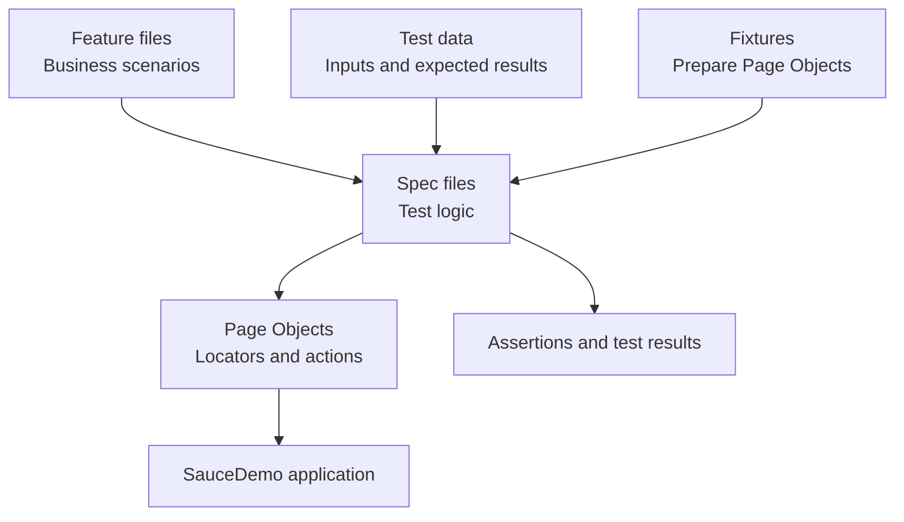

# Playwright Test Automation

End-to-end test automation framework built with Playwright and TypeScript.

This project demonstrates cross-browser UI automation for the SauceDemo e-commerce application using Page Object Model, custom Playwright fixtures, centralized test data, data-driven testing and continuous integration with GitHub Actions.


## Test Coverage

| Feature | Scenario | Test Type |
|---|---|---|
| Login | Verify that the login form is displayed and usable | Positive |
| Login | Login with valid credentials | Positive |
| Login | Display error for invalid credentials | Negative |
| Login | Display error when the username is empty | Negative |
| Login | Display error when the password is empty | Negative |
| Login | Display error for a locked-out user | Negative |
| Shopping Cart | Add and verify a product in the cart | Positive |
| Checkout | Complete an end-to-end order | Positive |
| Checkout | Display error when the first name is empty | Negative |
| Checkout | Display error when the last name is empty | Negative |
| Checkout | Display error when the postal code is empty | Negative |
| Assertions | Verify visibility, editability, attributes, text and URLs | Learning |
| Locators | Locate elements using role, placeholder, test ID, text and filters | Learning |
| Fixtures and Hooks | Reuse Page Objects and shared test setup | Learning |
| Reusable Business Flow | Add multiple products using a reusable Page Object method | Learning |

The suite contains:

```text
11 test scenarios
× 3 browsers
= 33 cross-browser test executions
```


## Framework Features

- End-to-end UI testing with Playwright
- TypeScript for type safety
- Page Object Model for reusable locators and actions
- Custom fixtures for automatic Page Object setup
- Test hooks for reusable test setup
- Centralized test data
- Data-driven positive and negative testing
- Playwright auto-waiting and retrying assertions
- User-facing and test ID locator strategies
- Gherkin feature documentation
- Cross-browser testing
- Playwright HTML reporting
- Continuous integration with GitHub Actions


## Learning Progress

| Lesson | Topic | Status |
|---|---|---|
| 1 | First Playwright automation | Completed |
| 2 | Project structure and cleanup | Completed |
| 3 | Page Object Model | Completed |
| 4 | Centralized test data | Completed |
| 5 | Gherkin feature documentation | Completed |
| 6 | Multi-page end-to-end flow | Completed |
| 7 | Playwright assertions | Completed |
| 8 | Locator deep dive | Completed |
| 9 | Custom fixtures and test hooks | Completed |


## Tech Stack

- Playwright
- TypeScript
- Node.js
- Page Object Model
- Custom Playwright Fixtures
- Data-Driven Testing
- Gherkin
- GitHub Actions
- Chromium, Firefox and WebKit


## Project Structure

```text
playwright-automation/
├── .github/
│   └── workflows/
│       └── playwright.yml
├── features/
│   ├── cart.feature
│   ├── checkout.feature
│   └── login.feature
├── fixtures/
│   └── pages.fixture.ts
├── pages/
│   ├── cart.page.ts
│   ├── checkout.page.ts
│   ├── inventory.page.ts
│   └── login.page.ts
├── test-data/
│   ├── checkout-cases.ts
│   ├── customers.ts
│   ├── login-cases.ts
│   └── users.ts
├── tests/
│   ├── cart.spec.ts
│   ├── checkout.spec.ts
│   └── login.spec.ts
├── playwright.config.ts
├── package.json
└── README.md
```


## How the Framework Works




## Prerequisites

Install:

- Node.js
- npm
- Git


## Installation

Clone the repository and install dependencies:

```bash
git clone https://github.com/HudaHussin/playwright-automation.git
cd playwright-automation
npm ci
npx playwright install
```


## Running Tests

Run all tests across Chromium, Firefox and WebKit:

```bash
npm test
```

Run Chromium only:

```bash
npx playwright test --project=chromium
```

Run tests in headed mode:

```bash
npm run test:headed
```

Open Playwright UI mode:

```bash
npm run test:ui
```

Run tests in debug mode:

```bash
npm run test:debug
```

View the latest HTML report:

```bash
npm run report
```


## Continuous Integration

GitHub Actions automatically runs the complete cross-browser test suite for every push and pull request to the `main` branch.

The Playwright HTML report is uploaded as a workflow artifact and retained for 30 days.


## Author

Huda Luna