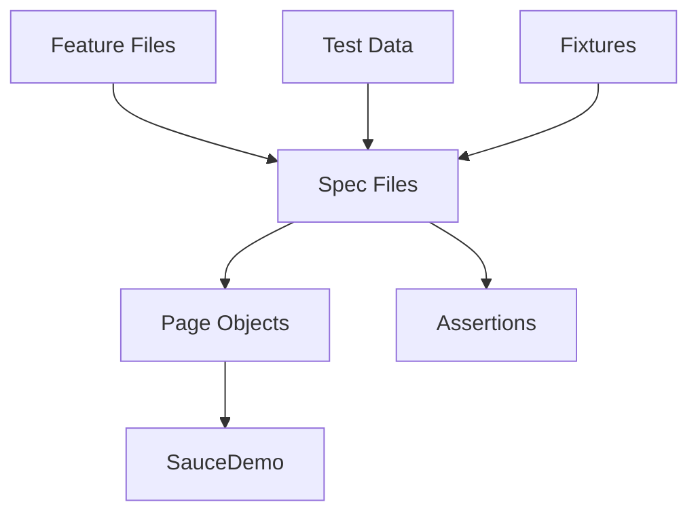

# Playwright Test Automation

End-to-end test automation framework built with Playwright and TypeScript.

This project demonstrates cross-browser UI automation for the SauceDemo e-commerce application using Page Object Model, custom Playwright fixtures, centralized test data, data-driven testing and continuous integration with GitHub Actions.

---

## Test Coverage

| Feature | Scenario | Test Type |
|----------|----------|-----------|
| Login | Verify that the login form is displayed and usable | Positive |
| Login | Login with valid credentials | Positive |
| Login | Display error for invalid credentials | Negative |
| Login | Display error when the username is empty | Negative |
| Login | Display error when the password is empty | Negative |
| Login | Display error for a locked-out user | Negative |
| Shopping Cart | Add and verify a product in the cart | Positive |
| Checkout | Complete an end-to-end order | Positive |
| Checkout | Display error when the first name is empty | Negative |
| Checkout | Display error when the last name is empty | Negative |
| Checkout | Display error when the postal code is empty | Negative |
| Assertions | Verify visibility, editability, attributes, text and URLs | Learning |
| Locators | Locate elements using role, placeholder, test ID, text and filters | Learning |
| Fixtures & Hooks | Reuse Page Objects and shared test setup | Learning |
| Reusable Business Flow | Add multiple products using reusable Page Object methods | Learning |

The framework currently contains:

```text
23 test scenarios
× 3 browsers
= 69 cross-browser test executions
```

---

## Framework Features

- End-to-end UI testing with Playwright
- TypeScript
- Page Object Model (POM)
- Reusable Page Object methods
- Custom Playwright Fixtures
- Test Hooks
- Centralized Test Data
- Data-Driven Testing
- Auto-wait & Retry Assertions
- Modern Locator Strategies
- Gherkin Feature Documentation
- Cross-browser Testing
- HTML Report
- GitHub Actions CI

---

## Learning Progress

| Lesson | Topic | Status |
|----------|-------------------------------|-----------|
| 1 | First Playwright Automation | ✅ Completed |
| 2 | Project Structure | ✅ Completed |
| 3 | Page Object Model | ✅ Completed |
| 4 | Test Data | ✅ Completed |
| 5 | Gherkin Feature Files | ✅ Completed |
| 6 | Multi-page Flow | ✅ Completed |
| 7 | Assertions | ✅ Completed |
| 8 | Locator Deep Dive | ✅ Completed |
| 9 | Fixtures & Hooks | ✅ Completed |
| 10 | Advanced POM & Reusable Methods | ✅ Completed |

---

## Tech Stack

- Playwright
- TypeScript
- Node.js
- Page Object Model
- Custom Fixtures
- Data-Driven Testing
- Gherkin
- GitHub Actions
- Chromium
- Firefox
- WebKit

---

## Project Structure

```text
playwright-automation/
│
├── .github/
│   └── workflows/
│       └── playwright.yml
│
├── features/
│   ├── cart.feature
│   ├── checkout.feature
│   └── login.feature
│
├── fixtures/
│   └── pages.fixture.ts
│
├── pages/
│   ├── cart.page.ts
│   ├── checkout.page.ts
│   ├── inventory.page.ts
│   └── login.page.ts
│
├── test-data/
│   ├── checkout-cases.ts
│   ├── customers.ts
│   ├── login-cases.ts
│   └── users.ts
│
├── tests/
│   ├── assertions.spec.ts
│   ├── business-flow.spec.ts
│   ├── cart.spec.ts
│   ├── checkout.spec.ts
│   ├── fixtures-hooks.spec.ts
│   ├── locators.spec.ts
│   └── login.spec.ts
│
├── playwright.config.ts
├── package.json
└── README.md
```

---

## Framework Architecture



---

## Prerequisites

Install:

- Node.js
- npm
- Git

---

## Installation

```bash
git clone https://github.com/HudaHussin/playwright-automation.git

cd playwright-automation

npm install

npx playwright install
```

---

## Run Tests

Run all browsers

```bash
npm test
```

Run Chromium only

```bash
npx playwright test --project=chromium
```

Run headed mode

```bash
npm run test:headed
```

Run UI mode

```bash
npm run test:ui
```

Run debug mode

```bash
npm run test:debug
```

Open HTML Report

```bash
npm run report
```

---

## Continuous Integration

GitHub Actions automatically executes the Playwright test suite on every push and pull request to the **main** branch.

The HTML Report is uploaded as a workflow artifact.

---

## Author

**Huda Luna**