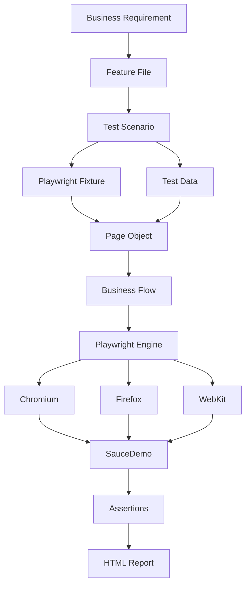

# Playwright Test Automation Framework

End-to-End UI Automation Framework built with **Playwright** and **TypeScript**.

This project demonstrates how to build a scalable, maintainable and reusable UI automation framework by applying modern Quality Engineering and Test Automation best practices.

The framework is designed around **Page Object Model (POM)**, **Custom Playwright Fixtures**, **Centralized Test Data**, **Data Driven Testing (DDT)**, **Reusable Business Methods**, **Cross-Browser Execution**, and **GitHub Actions Continuous Integration**, following an enterprise-style project structure commonly used in real-world software development.

The application under test is the **SauceDemo** e-commerce website.

---

# Objectives

This repository was created to:

- Learn Playwright from beginner to advanced level.
- Understand how a real-world automation framework is structured.
- Apply software engineering best practices to automation testing.
- Build reusable and maintainable test automation.
- Demonstrate Quality Engineering skills through a complete automation project.
- Continuously enhance the framework with more advanced automation capabilities.

---

# Key Highlights

- Built using **Playwright** with **TypeScript**
- Enterprise-style project structure
- Cross-browser automation (Chromium, Firefox & WebKit)
- Page Object Model (POM)
- Centralized Test Data
- Data Driven Testing (DDT)
- Custom Playwright Fixtures
- Reusable Business Flow methods
- GitHub Actions CI
- HTML Reporting
- Clean Architecture
- Beginner-to-Advanced Learning Journey

---

# Test Coverage

| Feature | Scenario | Test Type |
| :--- | :--- | :--- |
| Login | Verify login page is displayed | Positive |
| Login | Login with valid credentials | Positive |
| Login | Invalid username/password | Negative |
| Login | Empty username | Negative |
| Login | Empty password | Negative |
| Login | Locked-out user | Negative |
| Shopping Cart | Add product into cart | Positive |
| Shopping Cart | Verify shopping cart badge | Positive |
| Shopping Cart | Verify product appears in cart | Positive |
| Checkout | Complete end-to-end checkout | Positive |
| Checkout | Validate checkout overview | Positive |
| Checkout | Empty First Name | Negative |
| Checkout | Empty Last Name | Negative |
| Checkout | Empty Postal Code | Negative |
| Assertions | Visibility validation | Learning |
| Assertions | Text validation | Learning |
| Assertions | Attribute validation | Learning |
| Assertions | URL validation | Learning |
| Assertions | Enabled / Disabled validation | Learning |
| Locators | Role Locator | Learning |
| Locators | Placeholder Locator | Learning |
| Locators | Test ID Locator | Learning |
| Locators | Text Locator | Learning |
| Locators | Filter Locator | Learning |
| Fixtures | Shared Page Object setup | Learning |
| Business Flow | Reusable business methods | Learning |

Current execution:

```text
23 Test Scenarios
× 3 Browsers

Chromium
Firefox
WebKit

= 69 Cross-Browser Test Executions
```

---

# Framework Features

This framework demonstrates the implementation of modern Playwright automation concepts commonly adopted in enterprise projects.

## Core Automation Features

- End-to-End UI Automation
- Playwright Test Runner
- TypeScript
- Page Object Model (POM)
- Page Encapsulation
- Reusable Page Methods
- Business Flow Methods
- Locator Strategy Best Practices
- Assertions
- Auto Waiting
- Auto Retry Assertions

---

## Test Design

- Centralized Test Data
- Data Driven Testing (DDT)
- Positive Test Cases
- Negative Test Cases
- Boundary Validation
- Reusable Test Design
- Separation of Test Logic and Test Data

---

## Framework Design

- Custom Playwright Fixtures
- Test Hooks
- Shared Setup
- Clean Folder Structure
- Modular Architecture
- Maintainable Design
- Scalable Framework
- Separation of Concerns

---

## Execution

- Cross Browser Testing
- Chromium
- Firefox
- WebKit
- Parallel Execution Ready
- HTML Report
- Trace Viewer Support
- Debug Mode
- UI Mode
- Headed Execution

---

## DevOps

- Git
- GitHub
- GitHub Actions
- Continuous Integration (CI)
- Automatic Test Execution
- Report Artifact Upload

---

## Software Engineering Practices

- Readability
- Reusability
- Maintainability
- Scalability
- Clean Code
- Enterprise Project Structure
- Single Responsibility Principle (SRP)
- DRY (Don't Repeat Yourself)

---

# What You Will Learn From This Project

This repository is more than just a collection of automated test scripts.

It is designed as a complete learning project that demonstrates how a Playwright automation framework evolves from a simple test script into an enterprise-ready automation framework.

Throughout this project, the following concepts are progressively introduced:

- Project setup and configuration
- Automation framework architecture
- Page Object Model
- Locator strategies
- Assertions
- Test data management
- Data Driven Testing
- Fixtures and Hooks
- Business Flow abstraction
- Cross-browser execution
- Continuous Integration
- Reporting
- Framework scalability

The objective is not only to automate tests, but also to understand **why** each design decision is made and how different components of the framework work together in a real software testing project.

---

# Framework Architecture

The framework follows a layered architecture where each layer has a single responsibility. This separation makes the framework easier to maintain, scale, and reuse.

```text
                     Business Requirement
                              │
                              ▼
                     Feature Documentation
                         (.feature files)
                              │
                              ▼
                     Test Scenarios (*.spec.ts)
                              │
          ┌───────────────────┼────────────────────┐
          ▼                   ▼                    ▼
     Test Data            Fixtures          Playwright Config
          │                   │                    │
          └───────────────────┼────────────────────┘
                              ▼
                    Page Object Model (POM)
                              │
                              ▼
                     Business Flow Methods
                              │
                              ▼
                     Playwright Test Engine
                              │
               ┌──────────────┼──────────────┐
               ▼              ▼              ▼
          Chromium         Firefox         WebKit
               │              │              │
               └──────────────┼──────────────┘
                              ▼
                      SauceDemo Website
                              │
                              ▼
                          Assertions
                              │
                              ▼
                      HTML Test Report
```

---

# Framework Layer Explanation

## 1. Business Requirement

Every automation starts with a business requirement.

Example:

> "Customer should be able to login successfully."

Automation should always validate business behaviour rather than simply clicking buttons.

---

## 2. Feature Files

Feature files describe the expected business behaviour using Gherkin syntax.

Example:

```gherkin
Feature: Login

Scenario: Successful login
```

These files act as living documentation for the application.

Location:

```text
features/
```

---

## 3. Test Scenarios

Test files contain the executable automation scenarios.

Responsibilities:

- Arrange test data
- Execute business flow
- Verify expected behaviour

Location:

```text
tests/
```

Example:

```ts
test('User can login successfully', async () => {
    ...
});
```

The test file should focus on **what** is being tested, not **how** it is implemented.

---

## 4. Test Data

Test data is separated from test logic.

Instead of hardcoding values inside tests, all reusable data is stored in dedicated files.

Examples:

- Users
- Customers
- Login cases
- Checkout cases

Location:

```text
test-data/
```

Benefits:

- Easy maintenance
- Reusable data
- Cleaner test code
- Supports Data Driven Testing

---

## 5. Fixtures

Fixtures automatically prepare reusable objects before every test.

Instead of repeatedly creating Page Objects manually:

```ts
const loginPage = new LoginPage(page);
```

Fixtures provide them automatically:

```ts
test('...', async ({ loginPage }) => {
});
```

Location:

```text
fixtures/
```

Benefits:

- Less duplicate code
- Cleaner test setup
- Easier maintenance
- Better scalability

---

## 6. Page Object Model (POM)

Page Objects encapsulate everything related to a webpage.

Each Page Object contains:

- Locators
- Actions
- Helper methods
- Page-specific business logic

Example:

```text
Login Page

├── username textbox
├── password textbox
├── login button
└── login()
```

Location:

```text
pages/
```

Benefits:

- Single source of truth
- Easy locator updates
- High code reusability
- Improved readability

---

## 7. Business Flow Methods

Business Flow methods combine multiple page actions into reusable business processes.

Instead of repeating:

```text
Open Login
Enter Username
Enter Password
Click Login
Verify Inventory
```

The framework exposes a single reusable flow.

Example:

```ts
await loginPage.login(username, password);
```

This makes test cases shorter and easier to understand.

---

## 8. Playwright Test Engine

Playwright acts as the automation engine.

Responsibilities:

- Launch browser
- Execute commands
- Auto waiting
- Retry assertions
- Capture screenshots
- Generate traces
- Produce HTML reports

Playwright manages browser interaction while the framework manages business logic.

---

## 9. Browser Execution

The framework executes tests across multiple browsers.

Current supported browsers:

- Chromium
- Firefox
- WebKit

This ensures consistent application behaviour across different browser engines.

---

## 10. Assertions

Assertions validate the expected outcome.

Examples:

- Element is visible
- Text matches
- URL is correct
- Button is enabled
- Attribute exists

Assertions determine whether a test passes or fails.

---

## 11. HTML Report

After execution, Playwright generates an interactive HTML report.

The report contains:

- Passed tests
- Failed tests
- Error messages
- Screenshots
- Trace Viewer
- Execution time
- Browser information

The HTML report is the primary artifact used for analysing automation results.

---

# End-to-End Automation Flow

The following diagram illustrates the complete automation lifecycle from business requirement to test report.

```text
Business Requirement
          │
          ▼
Create Feature Documentation
          │
          ▼
Write Test Scenario
          │
          ▼
Prepare Test Data
          │
          ▼
Fixture Creates Page Objects
          │
          ▼
Page Object Executes Actions
          │
          ▼
Business Flow Performs User Journey
          │
          ▼
Playwright Controls Browser
          │
          ▼
SauceDemo Application
          │
          ▼
Assertions Validate Behaviour
          │
          ▼
Test Result
          │
          ▼
HTML Report
```

---

# Project Structure

```text
playwright-automation/
│
├── .github/
│   └── workflows/
│       └── playwright.yml
│
├── features/
│   ├── login.feature
│   ├── cart.feature
│   └── checkout.feature
│
├── fixtures/
│   └── pages.fixture.ts
│
├── pages/
│   ├── login.page.ts
│   ├── inventory.page.ts
│   ├── cart.page.ts
│   └── checkout.page.ts
│
├── test-data/
│   ├── users.ts
│   ├── customers.ts
│   ├── login-cases.ts
│   └── checkout-cases.ts
│
├── tests/
│   ├── login.spec.ts
│   ├── cart.spec.ts
│   ├── checkout.spec.ts
│   ├── assertions.spec.ts
│   ├── locators.spec.ts
│   ├── fixtures-hooks.spec.ts
│   └── business-flow.spec.ts
│
├── playwright.config.ts
├── package.json
├── package-lock.json
├── tsconfig.json
└── README.md
```

---

# Folder Responsibilities

| Folder | Responsibility |
| :--- | :--- |
| **tests/** | Contains all executable Playwright test scenarios. Tests focus on business behaviour and assertions rather than implementation details. |
| **pages/** | Implements the Page Object Model (POM). Each class represents a webpage and encapsulates locators, actions and reusable methods. |
| **fixtures/** | Provides shared Page Objects automatically before each test, reducing duplicate setup code. |
| **test-data/** | Stores reusable users, customers and test case data, enabling centralized data management and Data Driven Testing (DDT). |
| **features/** | Documents business requirements using Gherkin syntax. These files serve as readable specifications and living documentation. |
| **.github/** | Contains the GitHub Actions workflow that automatically executes the Playwright test suite during Continuous Integration (CI). |
| **playwright.config.ts** | Defines global Playwright configuration including browser projects, reporters, retries, timeouts, base URL and execution settings. |
| **package.json** | Manages project dependencies, npm scripts and package metadata required to build and execute the framework. |
| **tsconfig.json** | Configures the TypeScript compiler, ensuring consistent language features and project-wide type checking. |
| **README.md** | Provides project documentation, framework overview, setup instructions and learning roadmap. |

---

# Why This Architecture?

This framework intentionally separates responsibilities across multiple layers instead of placing everything inside test files.

By organising the project into **Page Objects**, **Fixtures**, **Test Data**, **Feature Files**, and **Test Scenarios**, the framework becomes easier to understand, maintain and extend as the number of automated tests grows.

This layered architecture follows automation framework design principles commonly used in enterprise software projects, making it suitable not only as a learning project but also as a foundation for building larger automation solutions.

---

# How the Framework Works

The following diagram illustrates how each component of the framework interacts during test execution.



---

# End-to-End Execution Flow

The diagram below represents what happens internally when a Playwright test is executed.

```text
Developer

    │

    ▼

Run Test
(npm test)

    │

    ▼

Playwright Test Runner

    │

    ▼

Fixture Initialisation

    │

    ▼

Create Page Objects

    │

    ▼

Read Test Data

    │

    ▼

Execute Business Flow

    │

    ▼

Interact With Browser

    │

    ▼

SauceDemo Website

    │

    ▼

Assertions

    │

    ▼

PASS / FAIL

    │

    ▼

Generate HTML Report
```

---

# Framework Design Principles

This framework follows several software engineering and automation design principles commonly adopted in enterprise environments.

## Separation of Concerns

Each folder has a dedicated responsibility.

Example:

- Tests describe **what** should happen.
- Page Objects describe **how** actions are performed.
- Test Data stores reusable input.
- Fixtures prepare reusable objects.
- Configuration controls framework behaviour.

This separation makes the framework easier to maintain as it grows.

---

## Reusability

Business logic is written once and reused across multiple test scenarios.

Instead of repeating login steps inside every test:

```ts
await loginPage.login(username, password);
```

The same method is reused throughout the project.

---

## Maintainability

If the application UI changes, only the corresponding Page Object usually requires modification.

The test scenarios remain unchanged because they depend on reusable page methods rather than individual locators.

---

## Scalability

The project structure allows additional pages, features and test suites to be added without restructuring the framework.

This makes the project suitable for larger automation initiatives.

---

## Readability

Tests are intentionally written in a business-readable manner.

Example:

```ts
await loginPage.login(user.username, user.password);

await inventoryPage.addProductToCart(productName);

await checkoutPage.completeCheckout(customer);
```

A reader can understand the business flow without needing to know implementation details.

---

# Skills Demonstrated

This project demonstrates practical experience in the following areas.

## Test Automation

- Playwright
- TypeScript
- End-to-End UI Automation
- Cross-Browser Testing
- Page Object Model (POM)
- Business Flow Design
- Locator Strategies
- Assertions
- Auto Waiting
- Retry Assertions

---

## Framework Design

- Enterprise Framework Structure
- Modular Architecture
- Custom Playwright Fixtures
- Test Hooks
- Reusable Components
- Data Driven Testing (DDT)
- Centralised Test Data
- Separation of Concerns
- Clean Code Principles

---

## Quality Engineering

- Positive Testing
- Negative Testing
- Boundary Validation
- Business Scenario Validation
- Maintainable Automation Design
- Scalable Test Architecture

---

## DevOps

- Git
- GitHub
- GitHub Actions
- Continuous Integration (CI)
- HTML Reporting
- Trace Viewer
- Headed Execution
- UI Mode
- Debug Mode

---

## Software Engineering

- TypeScript
- Object-Oriented Programming (OOP)
- SOLID (Single Responsibility Principle)
- DRY (Don't Repeat Yourself)
- Modular Design
- Readability
- Reusability
- Maintainability

---

# Learning Progress

This repository documents my learning journey from learning Playwright fundamentals to building a structured automation framework.

| Lesson | Topic | Status |
| :--- | :--- | :--- |
| 01 | Playwright Installation & Setup | ✅ Completed |
| 02 | Project Structure | ✅ Completed |
| 03 | Page Object Model (POM) | ✅ Completed |
| 04 | Centralised Test Data | ✅ Completed |
| 05 | Gherkin Feature Files | ✅ Completed |
| 06 | End-to-End Multi-Page Flow | ✅ Completed |
| 07 | Assertions | ✅ Completed |
| 08 | Locator Strategies | ✅ Completed |
| 09 | Fixtures & Hooks | ✅ Completed |
| 10 | Reusable Business Flow | ✅ Completed |

---

## Current Framework Capabilities

✔ Page Object Model

✔ Data Driven Testing

✔ Custom Fixtures

✔ Business Flow Methods

✔ Cross-Browser Execution

✔ GitHub Actions CI

✔ HTML Reporting

✔ Auto Waiting

✔ Assertions

✔ Locator Best Practices

✔ Modular Framework Architecture

✔ Enterprise Folder Structure

---

## Upcoming Learning Roadmap

The framework will continue evolving with additional enterprise automation capabilities.

Planned topics include:

- API Testing
- Authentication State
- Network Interception
- File Upload & Download
- Visual Regression Testing
- Environment Configuration
- Parallel Execution
- Docker
- Jenkins
- Azure DevOps Pipelines
- Database Validation
- Advanced Reporting
- Performance Testing Integration

---

# Tech Stack

| Category | Technology |
| :--- | :--- |
| Programming Language | TypeScript |
| Automation Framework | Playwright |
| Runtime | Node.js |
| Test Runner | Playwright Test |
| Design Pattern | Page Object Model (POM) |
| Test Design | Data Driven Testing (DDT) |
| Fixtures | Playwright Fixtures |
| Version Control | Git |
| Repository | GitHub |
| CI/CD | GitHub Actions |
| Documentation | Gherkin Feature Files |
| Browsers | Chromium, Firefox, WebKit |

---

# Prerequisites

Before running this project, ensure the following software is installed.

| Software | Purpose |
| :--- | :--- |
| Node.js | JavaScript Runtime |
| npm | Package Management |
| Git | Version Control |
| Visual Studio Code | Code Editor |
| Playwright Browsers | Browser Automation |

Verify installation:

```bash
node -v

npm -v

git --version

npx playwright --version
```

If Playwright browsers have not been installed:

```bash
npx playwright install
```

---

# Installation

Clone the repository:

```bash
git clone https://github.com/HudaHussin/playwright-automation.git
```

Navigate into the project directory:

```bash
cd playwright-automation
```

Install project dependencies:

```bash
npm install
```

Install Playwright browsers:

```bash
npx playwright install
```

Verify the installation:

```bash
npx playwright --version
```

---

# Available npm Scripts

| Command | Description |
| :--- | :--- |
| `npm test` | Run the complete Playwright test suite |
| `npm run test:headed` | Execute tests in headed mode |
| `npm run test:ui` | Launch Playwright UI Mode |
| `npm run test:debug` | Run tests in debug mode |
| `npm run report` | Open the latest HTML report |

---

# Running Tests

## Run the complete test suite

```bash
npm test
```

---

## Run all tests using Chromium only

```bash
npx playwright test --project=chromium
```

---

## Run a specific test file

```bash
npx playwright test tests/login.spec.ts
```

---

## Run a single test by title

```bash
npx playwright test -g "Login with valid credentials"
```

---

## Run tests in headed mode

```bash
npm run test:headed
```

---

## Run tests in UI Mode

```bash
npm run test:ui
```

UI Mode allows developers to:

- Execute individual tests
- Inspect locators
- Debug step-by-step
- Re-run failed tests
- View traces
- Improve test development productivity

---

## Run tests in Debug Mode

```bash
npm run test:debug
```

Debug Mode pauses execution, allowing interactive inspection of browser actions and test behaviour.

---

# Test Reports

After every execution, Playwright generates an interactive HTML report.

Open the report:

```bash
npm run report
```

The report provides:

- Test summary
- Passed tests
- Failed tests
- Execution duration
- Error stack traces
- Screenshots (when configured)
- Trace Viewer
- Browser information
- Retry information

HTML reports help developers quickly identify failures and investigate root causes.

---

# Cross-Browser Testing

This framework validates application behaviour across multiple browser engines.

Supported browsers:

- Chromium
- Firefox
- WebKit

Execution flow:

```text
Playwright

      │

      ▼

Chromium

Firefox

WebKit

      │

      ▼

Same Test Suite

      │

      ▼

Consistent Behaviour Validation
```

Running the same tests across different browsers helps detect browser-specific issues early in the development lifecycle.

---

# Continuous Integration (CI)

This project includes GitHub Actions to automatically execute the Playwright test suite whenever code changes are pushed to the repository.

Current CI workflow:

```text
Developer

    │

git push

    │

    ▼

GitHub Repository

    │

    ▼

GitHub Actions

    │

    ▼

Checkout Repository

    │

    ▼

Install Dependencies

    │

    ▼

Install Playwright Browsers

    │

    ▼

Execute Test Suite

    │

    ▼

Generate HTML Report

    │

    ▼

Upload Report Artifact

    │

    ▼

CI Result
```

Benefits of Continuous Integration:

- Detect regressions early
- Validate automation after every change
- Improve collaboration
- Ensure framework stability
- Automatically generate test reports

---

# Framework Design Philosophy

This project was intentionally developed using an enterprise-style automation architecture rather than placing all automation code inside individual test files.

The primary objectives are:

- Readability
- Reusability
- Maintainability
- Scalability
- Modularity
- Separation of Concerns

Instead of focusing only on writing automated tests, this project emphasises designing a framework that can continue to grow as additional features and test suites are introduced.

Each layer of the framework has a clearly defined responsibility:

- Test Scenarios describe business behaviour.
- Page Objects encapsulate UI interactions.
- Fixtures manage shared setup.
- Test Data centralises reusable input.
- Feature Files document business requirements.
- Playwright provides browser automation capabilities.

This layered approach reduces duplication, improves maintainability, and makes the framework easier to understand for both new and experienced automation engineers.

---

# Future Learning Roadmap

The framework will continue evolving as more advanced Playwright concepts are implemented.

## API Testing

- REST API Validation
- API Assertions
- Request & Response Handling

---

## Authentication

- Storage State
- Session Reuse
- Login Optimisation

---

## Network

- Request Interception
- Response Mocking
- API Stubbing

---

## Database

- SQL Validation
- Database Assertions

---

## Advanced Automation

- File Upload
- File Download
- Visual Regression Testing
- Shadow DOM
- iFrame Handling
- Multi-tab Testing

---

## Reporting

- Allure Report
- Custom Reporters
- Test Analytics

---

## CI/CD

- Docker
- Jenkins
- Azure DevOps
- GitHub Actions Enhancement

---

## Performance & Quality

- Lighthouse
- Performance Metrics
- Automation Best Practices
- Framework Optimisation

---

# Project Goals

This repository aims to demonstrate the progressive development of a maintainable Playwright automation framework while documenting the learning journey from beginner to more advanced automation concepts.

The project focuses on building practical automation skills together with software engineering principles that are commonly applied in enterprise Quality Engineering teams.

---

# Acknowledgements

Special thanks to:

- Microsoft Playwright Team
- SauceDemo
- The Playwright Community

for providing excellent tools and learning resources that make modern test automation accessible.

---

# Author

## Huda Hussin

**QA Lead | Quality Engineering | Test Strategy | Test Automation**

Experienced Quality Assurance professional with expertise in Digital Banking, Enterprise Platforms, Release Governance, Test Strategy and Quality Engineering.

This repository documents my hands-on learning journey in Playwright while applying enterprise automation practices and continuously improving the framework through incremental enhancements.

GitHub:

```text
https://github.com/HudaHussin
```

---

## If you found this repository useful

⭐ Star this repository

🍴 Fork it

📖 Follow the learning journey

🚀 Happy Automating!