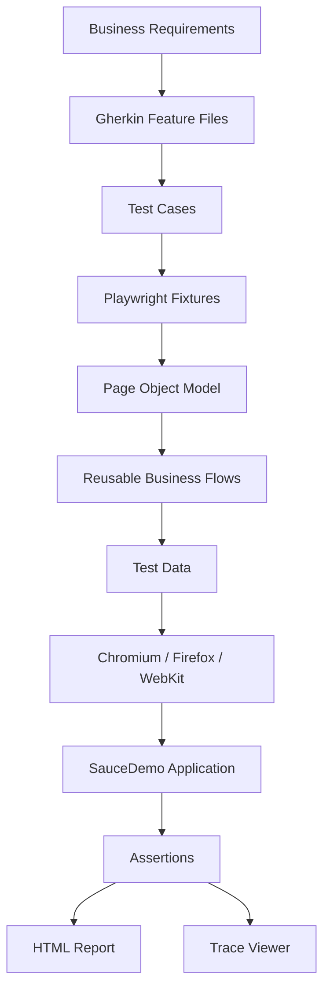
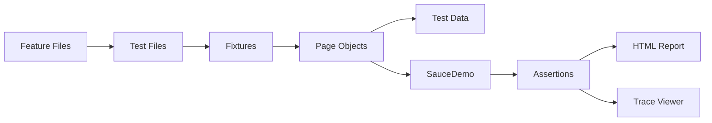

# 🚀 Playwright Test Automation Framework

<p align="center">
  <strong>Enterprise-Style End-to-End UI Automation Framework built with Playwright and TypeScript</strong>
</p>

<p align="center">
  A practical automation framework demonstrating modern Quality Engineering practices,
  reusable framework architecture and cross-browser testing using Playwright.
</p>

---

<p align="center">


</p>

---

## 📌 Quick Navigation

- [Project Overview](#-project-overview)
- [Framework Highlights](#-framework-highlights)
- [Framework Architecture](#-framework-architecture)
- [Test Coverage](#-test-coverage)
- [Project Structure](#-project-structure)
- [Framework Features](#-framework-features)
- [Screenshots](#-screenshots)
- [Installation](#-installation)
- [Running Tests](#-running-tests)
- [Learning Journey](#-learning-journey)
- [Framework Evolution](#-framework-evolution)
- [Future Roadmap](#-future-roadmap)
- [Version & Changelog](#-version--changelog)
- [Author](#-author)

---

## ⭐ At a Glance

| Item | Details |
|------|---------|
| 🎯 Application Under Test | SauceDemo |
| 🧪 Test Scenarios | **23** |
| 🌐 Browser Projects | Chromium • Firefox • WebKit |
| 🚀 Total Executions | **69 Cross-Browser Executions** |
| 🛠 Framework Pattern | Page Object Model (POM) |
| 📂 Test Data | Centralized & Data-Driven |
| ⚙️ Fixtures | Custom Playwright Fixtures |
| 📊 Reporting | HTML Report & Trace Viewer |
| 🔄 CI/CD | GitHub Actions |
| 💻 Language | TypeScript |
| 🎭 Test Framework | Playwright Test |

---

> **Repository Goal**
>
> Build a clean, scalable and maintainable Playwright automation framework that follows industry best practices while documenting the journey from beginner to enterprise-level Quality Engineering.

# 📖 Project Overview

This repository showcases an **enterprise-style End-to-End UI Automation Framework** built with **Playwright** and **TypeScript**, using the SauceDemo web application as the automation target.

Rather than focusing solely on writing automated test scripts, this project demonstrates how a modern automation framework is designed using reusable architecture, clean code principles and industry best practices. The framework separates business scenarios, page interactions, test data and framework configuration into well-organized, reusable components, making it easier to maintain, scale and extend.

The framework currently incorporates the following engineering practices:

- Page Object Model (POM)
- Centralized Test Data
- Data-Driven Testing (DDT)
- Custom Playwright Fixtures
- Reusable Business Flow Methods
- Cross-Browser Testing
- GitHub Actions Continuous Integration (CI)
- HTML Report and Trace Viewer

This repository is continuously enhanced as new automation engineering concepts and Playwright capabilities are implemented, reflecting the progressive evolution of the framework.

---

## 🎯 Project Objectives

- Build a clean, maintainable and scalable Playwright automation framework.
- Apply automation design patterns commonly used in enterprise projects.
- Reduce code duplication through reusable framework components.
- Automate complete end-to-end business workflows.
- Integrate automated testing into a Continuous Integration (CI) pipeline.
- Continuously enhance the framework with advanced Playwright capabilities.

---

## 💼 What This Repository Demonstrates

| Category | Demonstrated Skills |
|----------|---------------------|
| UI Automation | End-to-End Functional Testing, Cross-Browser Testing |
| Framework Design | Page Object Model (POM), Reusable Components, Custom Fixtures |
| Test Design | Positive Testing, Negative Testing, Data-Driven Testing |
| Quality Engineering | Assertions, Locator Strategies, Business Flow Validation |
| DevOps | Git, GitHub, GitHub Actions CI |
| Documentation | Gherkin Feature Files, Framework Documentation, Architecture Diagrams |

> **Repository Purpose**
>
> This project is designed to demonstrate practical automation engineering skills through a structured, production-style Playwright framework while continuously evolving with new features, design improvements and Quality Engineering best practices.

# 🚀 Framework Highlights

This framework is built using modern automation engineering practices to ensure the test suite remains clean, reusable, maintainable and scalable as it grows.

| Feature | Description |
|----------|-------------|
| 🎭 **Playwright Test** | Modern end-to-end automation framework with built-in test runner. |
| 💙 **TypeScript** | Strong typing for improved code quality, readability and maintainability. |
| 📄 **Page Object Model (POM)** | Separates page interactions from test logic for better reusability. |
| 📊 **Centralized Test Data** | Test data is managed in dedicated files for easier maintenance. |
| 🔄 **Data-Driven Testing (DDT)** | Executes multiple test scenarios using reusable datasets. |
| 🧩 **Custom Fixtures** | Provides reusable page objects and shared test setup. |
| 🔁 **Reusable Business Flows** | Common user journeys are encapsulated into reusable methods. |
| 🌐 **Cross-Browser Testing** | Executes tests across Chromium, Firefox and WebKit. |
| ✅ **Rich Assertions** | Verifies UI behaviour using Playwright's built-in assertion library. |
| 🎯 **Modern Locator Strategies** | Uses role, test ID, placeholder and accessible locators for reliable element identification. |
| 📈 **HTML Report** | Generates interactive execution reports after every test run. |
| 🔍 **Trace Viewer** | Captures detailed execution traces for debugging failed tests. |
| ⚙️ **GitHub Actions CI** | Automatically executes the test suite on every push and pull request. |
| 📚 **Gherkin Feature Files** | Documents business scenarios using Behaviour-Driven Development (BDD) style. |

---

## 📊 Framework Summary

| Item | Status |
|------|:------:|
| Playwright Test | ✅ |
| TypeScript | ✅ |
| Page Object Model (POM) | ✅ |
| Centralized Test Data | ✅ |
| Data-Driven Testing (DDT) | ✅ |
| Custom Fixtures | ✅ |
| Reusable Business Flows | ✅ |
| Assertions | ✅ |
| Modern Locator Strategies | ✅ |
| Cross-Browser Testing | ✅ |
| HTML Report | ✅ |
| Trace Viewer | ✅ |
| GitHub Actions CI | ✅ |
| Gherkin Feature Files | ✅ |

# 🏗️ Framework Architecture

The framework follows a layered architecture that separates business scenarios, test logic, page interactions, test data and configuration into independent, reusable components. This modular design improves readability, reduces code duplication and makes the framework easier to maintain and extend as the test suite grows.

```text
                         Playwright Test Framework
┌──────────────────────────────────────────────────────────────────────────┐
│                          Business Scenarios                              │
│                 (Gherkin Feature Files / Test Cases)                     │
└───────────────────────────────┬──────────────────────────────────────────┘
                                │
                                ▼
┌──────────────────────────────────────────────────────────────────────────┐
│                               Test Layer                                 │
│                 Login │ Cart │ Checkout │ Future Tests                   │
└───────────────────────────────┬──────────────────────────────────────────┘
                                │
                                ▼
┌──────────────────────────────────────────────────────────────────────────┐
│                           Playwright Fixtures                            │
│           Shared Setup │ Browser │ Page Objects │ Test Context           │
└───────────────────────────────┬──────────────────────────────────────────┘
                                │
                                ▼
┌──────────────────────────────────────────────────────────────────────────┐
│                         Page Object Model (POM)                          │
│   LoginPage │ InventoryPage │ CartPage │ CheckoutPage │ Future Pages     │
└───────────────────────────────┬──────────────────────────────────────────┘
                                │
                                ▼
┌──────────────────────────────────────────────────────────────────────────┐
│                          Reusable Business Flows                         │
│      Login │ Add Product │ Checkout │ Validation │ Helper Methods        │
└───────────────────────────────┬──────────────────────────────────────────┘
                                │
                                ▼
┌──────────────────────────────────────────────────────────────────────────┐
│                           Test Data Management                           │
│        Users │ Login Cases │ Expected Results │ Future Test Data         │
└───────────────────────────────┬──────────────────────────────────────────┘
                                │
                                ▼
┌──────────────────────────────────────────────────────────────────────────┐
│                       Playwright Browser Engine                          │
│                 Chromium │ Firefox │ WebKit                              │
└───────────────────────────────┬──────────────────────────────────────────┘
                                │
                                ▼
┌──────────────────────────────────────────────────────────────────────────┐
│                        Application Under Test                            │
│                               SauceDemo                                 │
└───────────────────────────────┬──────────────────────────────────────────┘
                                │
                                ▼
┌──────────────────────────────────────────────────────────────────────────┐
│                    Assertions • Reports • Trace Viewer                   │
└──────────────────────────────────────────────────────────────────────────┘
```

---

## 🔄 Framework Workflow



---

## 🧩 Architecture Layers

| Layer | Responsibility |
|--------|----------------|
| **Feature Files** | Documents business requirements and user scenarios using Gherkin syntax. |
| **Tests** | Defines test scenarios, assertions and execution flow. |
| **Fixtures** | Provides shared setup, reusable page objects and common test context. |
| **Page Objects** | Encapsulates UI locators and page-specific actions. |
| **Business Flows** | Reuses common end-to-end user journeys to reduce duplication. |
| **Test Data** | Centralizes users, datasets and expected results. |
| **Browser Layer** | Executes tests across Chromium, Firefox and WebKit. |
| **Application Layer** | Represents the application under test (SauceDemo). |
| **Reporting Layer** | Produces HTML reports and Trace Viewer artifacts for debugging and analysis. |

---

## 🎯 Architecture Benefits

- Modular and easy-to-maintain framework structure.
- Clear separation between business logic and UI interactions.
- Reusable components that minimise code duplication.
- Centralized test data for easier maintenance.
- Scalable architecture for adding new pages and test scenarios.
- Cross-browser execution with minimal configuration changes.
- Production-style framework aligned with modern Quality Engineering practices.

# 🧪 Test Coverage

The framework currently covers the core business workflows of the SauceDemo application, including positive scenarios, negative validation, reusable assertions and cross-browser execution. Each test is designed to validate real user behaviour while following a structured and maintainable automation approach.

---

## 📋 Test Coverage Matrix

| Module | Scenario | Test Type | Status |
|---------|----------|-----------|:------:|
| **Login** | Verify login page is displayed | Positive | ✅ |
| **Login** | Login with valid credentials | Positive | ✅ |
| **Login** | Login with invalid credentials | Negative | ✅ |
| **Login** | Username is empty | Negative | ✅ |
| **Login** | Password is empty | Negative | ✅ |
| **Login** | Locked out user | Negative | ✅ |
| **Shopping Cart** | Add product to cart | Positive | ✅ |
| **Shopping Cart** | Verify cart badge updates | Positive | ✅ |
| **Shopping Cart** | Verify selected product in cart | Positive | ✅ |
| **Checkout** | Complete end-to-end checkout | Positive | ✅ |
| **Checkout** | First name is empty | Negative | ✅ |
| **Checkout** | Last name is empty | Negative | ✅ |
| **Checkout** | Postal code is empty | Negative | ✅ |
| **Assertions** | Verify element visibility | Validation | ✅ |
| **Assertions** | Verify editable fields | Validation | ✅ |
| **Assertions** | Verify enabled elements | Validation | ✅ |
| **Assertions** | Verify password field attribute | Validation | ✅ |
| **Assertions** | Verify current URL | Validation | ✅ |
| **Assertions** | Verify successful login page | Validation | ✅ |
| **Locator Strategies** | Locate element by Role | Validation | ✅ |
| **Locator Strategies** | Locate element by Placeholder | Validation | ✅ |
| **Locator Strategies** | Locate element by Test ID | Validation | ✅ |
| **Data-Driven Testing** | Multiple login datasets | Validation | ✅ |

---

## 📊 Coverage Summary

| Category | Coverage |
|----------|---------:|
| Total Test Scenarios | **23** |
| Positive Tests | **8** |
| Negative Tests | **8** |
| Validation Tests | **7** |
| Browser Projects | **3** |
| Total Cross-Browser Executions | **69** |

---

## 🌐 Browser Coverage

| Browser | Status |
|---------|:------:|
| Chromium | ✅ |
| Firefox | ✅ |
| WebKit | ✅ |

---

## ✅ Quality Areas Covered

- User Authentication
- Form Validation
- End-to-End Business Workflow
- Shopping Cart Functionality
- Checkout Process
- UI Assertions
- Locator Strategies
- Data-Driven Testing
- Cross-Browser Compatibility
- HTML Reporting
- Trace Viewer Debugging

---

> **Coverage Status**
>
> The test suite is continuously expanded as new framework capabilities and automation scenarios are implemented. Future coverage will include API Testing, Authentication, Network Interception, Visual Testing, Database Validation and other advanced Playwright features.

# 📁 Project Structure

The framework is organised using a modular folder structure that separates test scenarios, page interactions, test data, configuration and supporting resources into dedicated directories. This structure improves readability, encourages code reuse and simplifies long-term maintenance as the framework grows.

```text
playwright-automation/
│
├── .github/
│   └── workflows/
│       └── playwright.yml          # GitHub Actions CI workflow
│
├── features/
│   ├── login.feature
│   ├── cart.feature
│   └── checkout.feature
│
├── fixtures/
│   └── pages.fixture.ts
│
├── pages/
│   ├── login.page.ts
│   ├── inventory.page.ts
│   ├── cart.page.ts
│   └── checkout.page.ts
│
├── test-data/
│   ├── users.ts
│   └── login-cases.ts
│
├── tests/
│   ├── login.spec.ts
│   ├── cart.spec.ts
│   ├── checkout.spec.ts
│   ├── lesson7-assertions.spec.ts
│   └── lesson8-locators.spec.ts
│
├── playwright-report/             # HTML Report (generated)
├── test-results/                  # Test artifacts (generated)
├── package.json
├── package-lock.json
├── playwright.config.ts
├── tsconfig.json
└── README.md
```

---

## 📂 Directory Responsibilities

| Directory / File | Responsibility |
|------------------|----------------|
| **.github/workflows** | Stores GitHub Actions workflows for Continuous Integration (CI). |
| **features** | Documents business scenarios using Gherkin Feature Files. |
| **fixtures** | Provides reusable Playwright fixtures, shared setup and page object injection. |
| **pages** | Implements the Page Object Model (POM), containing page locators and reusable actions. |
| **test-data** | Centralises test users, datasets and expected values for Data-Driven Testing. |
| **tests** | Contains automated test scenarios and assertions that validate application behaviour. |
| **playwright-report** | Stores generated HTML execution reports after test runs. |
| **test-results** | Stores execution artifacts such as traces, screenshots and logs. |
| **playwright.config.ts** | Defines global Playwright configuration including browsers, reporters, retries and execution settings. |
| **package.json** | Manages project dependencies, scripts and framework metadata. |
| **tsconfig.json** | Configures TypeScript compiler options for the project. |
| **README.md** | Documents the framework, architecture, usage and learning journey. |

---

## 🔗 Component Relationships



---

## 🎯 Structure Benefits

- Clear separation of responsibilities across the framework.
- Improved readability through modular organisation.
- Reusable page objects and fixtures reduce duplicated code.
- Centralised test data simplifies maintenance and expansion.
- Supports scalable growth as additional pages and scenarios are introduced.
- Aligns with enterprise automation framework design principles and modern Quality Engineering practices.

# ⚙️ Framework Features

The framework is built around modern automation engineering principles that promote maintainability, scalability and reusability. Each feature has been introduced to improve framework quality, simplify test development and support long-term growth.

---

## 🏗️ Framework Architecture

| Feature | Description |
|---------|-------------|
| **Page Object Model (POM)** | Separates page interactions from test logic, making tests easier to maintain and reuse. |
| **Modular Folder Structure** | Organises framework components into dedicated directories with clear responsibilities. |
| **Reusable Business Flows** | Encapsulates common user journeys into reusable methods to reduce duplication. |
| **Centralized Test Data** | Stores users, datasets and expected results separately from test logic. |
| **Custom Playwright Fixtures** | Provides shared setup and reusable page object injection across test suites. |
| **Scalable Framework Design** | Makes it easy to introduce new pages, scenarios and business modules without restructuring the project. |

---

## 🧪 Test Automation

| Feature | Description |
|---------|-------------|
| **End-to-End Testing** | Validates complete business workflows from login to checkout. |
| **Positive & Negative Testing** | Covers both successful user journeys and validation/error scenarios. |
| **Data-Driven Testing (DDT)** | Executes multiple test scenarios using reusable datasets. |
| **Cross-Browser Testing** | Runs the same test suite across Chromium, Firefox and WebKit. |
| **Modern Locator Strategies** | Uses Role, Test ID, Placeholder and accessible locators for reliable element identification. |
| **Rich Assertions** | Verifies application behaviour using Playwright's built-in assertion library. |
| **Gherkin Feature Files** | Documents business scenarios using Behaviour-Driven Development (BDD) style. |

---

## 🚀 Reporting & CI/CD

| Feature | Description |
|---------|-------------|
| **HTML Report** | Generates interactive execution reports after every test run. |
| **Trace Viewer** | Captures execution traces for debugging failed test cases. |
| **GitHub Actions CI** | Automatically executes the test suite on every push and pull request. |
| **Automatic Test Execution** | Supports repeatable and consistent execution across environments. |

---

## 📈 Framework Capabilities

| Capability | Status |
|------------|:------:|
| Page Object Model (POM) | ✅ |
| Modular Project Structure | ✅ |
| Centralized Test Data | ✅ |
| Data-Driven Testing (DDT) | ✅ |
| Custom Fixtures | ✅ |
| Reusable Business Flows | ✅ |
| Positive & Negative Testing | ✅ |
| Assertions | ✅ |
| Modern Locator Strategies | ✅ |
| Cross-Browser Testing | ✅ |
| HTML Report | ✅ |
| Trace Viewer | ✅ |
| GitHub Actions CI | ✅ |
| Gherkin Feature Files | ✅ |

---

## 🎯 Engineering Benefits

- Improves framework maintainability through modular architecture.
- Reduces code duplication using reusable components and business flows.
- Simplifies test maintenance by centralising locators and test data.
- Supports scalable growth as new features and test scenarios are introduced.
- Produces reliable and repeatable test execution across multiple browsers.
- Integrates automated testing into a Continuous Integration (CI) workflow.
- Follows modern Quality Engineering and automation framework best practices.

# 📸 Framework Screenshots

The screenshots below provide a visual overview of the framework, demonstrating test execution, reporting and debugging capabilities. They highlight how Playwright supports efficient test analysis, failure investigation and Continuous Integration workflows.

---

## 🖥️ HTML Report

> Interactive Playwright HTML Report summarising test execution results, pass/fail status, execution duration and detailed test information.

<p align="center">

> 📷 **Screenshot Placeholder**  
> `docs/screenshots/html-report.png`

</p>

---

## 🎭 UI Mode

> Playwright UI Mode enables interactive test execution, debugging and step-by-step development with live test exploration.

<p align="center">

> 📷 **Screenshot Placeholder**  
> `docs/screenshots/ui-mode.png`

</p>

---

## 🔍 Trace Viewer

> Trace Viewer provides detailed execution traces, screenshots, DOM snapshots, network activity and action timelines to simplify failure investigation.

<p align="center">

> 📷 **Screenshot Placeholder**  
> `docs/screenshots/trace-viewer.png`

</p>

---

## ⚙️ GitHub Actions

> Continuous Integration (CI) pipeline automatically executes the Playwright test suite on every push and pull request, ensuring consistent validation across the framework.

<p align="center">

> 📷 **Screenshot Placeholder**  
> `docs/screenshots/github-actions.png`

</p>

---

## 📊 Test Execution Overview

| Screenshot | Purpose |
|------------|---------|
| **HTML Report** | Review execution summary, passed and failed tests, duration and detailed results. |
| **UI Mode** | Execute and debug tests interactively during framework development. |
| **Trace Viewer** | Investigate failures with execution timeline, screenshots and DOM snapshots. |
| **GitHub Actions** | Verify automated execution and Continuous Integration workflow on GitHub. |

---

> **Note**
>
> Screenshot placeholders will be replaced with actual framework screenshots as additional features and reports are implemented throughout the project's evolution.

# 🚀 Installation

Follow the steps below to set up the project and run the Playwright automation framework on your local machine.

---

## 📋 Prerequisites

Ensure the following software is installed before getting started.

| Software | Recommended Version |
|-----------|---------------------|
| Node.js | 20.x or later |
| npm | Latest |
| Git | Latest |
| Visual Studio Code | Latest |
| Playwright | Installed via npm |

---

## 📥 Clone the Repository

```bash
git clone https://github.com/HudaHussin/playwright-automation.git
```

Navigate into the project directory.

```bash
cd playwright-automation
```

---

## 📦 Install Dependencies

Install all project dependencies defined in `package.json`.

```bash
npm install
```

---

## 🎭 Install Playwright Browsers

Download the required browser binaries used by Playwright.

```bash
npx playwright install
```

---

## ✅ Verify Installation

Confirm that Playwright has been installed successfully.

```bash
npx playwright --version
```

Expected output (example):

```text
Version 1.61.1
```

---

## 📁 Project Ready

Once installation is complete, the project structure should resemble the following:

```text
playwright-automation/
├── features/
├── fixtures/
├── pages/
├── test-data/
├── tests/
├── playwright.config.ts
├── package.json
└── README.md
```

You are now ready to execute the Playwright test suite.

---

## 🛠️ Installation Checklist

| Step | Status |
|------|:------:|
| Clone Repository | ✅ |
| Install Dependencies | ✅ |
| Install Playwright Browsers | ✅ |
| Verify Installation | ✅ |
| Ready to Execute Tests | ✅ |

# ▶️ Running Tests

The framework supports multiple execution modes to accommodate different testing and development workflows. Whether validating a single test, debugging interactively or executing the complete test suite across multiple browsers, Playwright provides flexible and reliable execution options.

---

## 🚀 Run All Tests

Execute the complete test suite across all configured browser projects.

```bash
npx playwright test
```

---

## 🌐 Run Tests on a Specific Browser

### Chromium

```bash
npx playwright test --project=chromium
```

### Firefox

```bash
npx playwright test --project=firefox
```

### WebKit

```bash
npx playwright test --project=webkit
```

---

## 📄 Run a Specific Test File

Execute an individual test file.

### Login Tests

```bash
npx playwright test tests/login.spec.ts
```

### Shopping Cart Tests

```bash
npx playwright test tests/cart.spec.ts
```

### Checkout Tests

```bash
npx playwright test tests/checkout.spec.ts
```

### Assertions Lesson

```bash
npx playwright test tests/lesson7-assertions.spec.ts
```

### Locator Strategies Lesson

```bash
npx playwright test tests/lesson8-locators.spec.ts
```

---

## 🎯 Run a Single Test

Execute a specific test by matching its title.

```bash
npx playwright test -g "Login with valid credentials"
```

---

## 👀 Run Tests in Headed Mode

Launch the browser with a visible user interface.

```bash
npx playwright test --headed
```

---

## 🎭 Run Playwright UI Mode

Launch Playwright's interactive UI for test execution and debugging.

```bash
npx playwright test --ui
```

---

## 🐞 Run Tests in Debug Mode

Pause execution and inspect each action step by step.

```bash
npx playwright test --debug
```

---

## 📊 Open the HTML Report

View the most recent execution report.

```bash
npx playwright show-report
```

---

## 🧹 Update Playwright

Update Playwright to the latest compatible version.

```bash
npm install @playwright/test@latest
```

Install any required browser updates.

```bash
npx playwright install
```

Verify the installed version.

```bash
npx playwright --version
```

---

## 📋 Common Commands

| Command | Purpose |
|---------|---------|
| `npx playwright test` | Run the complete test suite |
| `npx playwright test --project=chromium` | Run tests in Chromium |
| `npx playwright test --project=firefox` | Run tests in Firefox |
| `npx playwright test --project=webkit` | Run tests in WebKit |
| `npx playwright test --headed` | Run tests with a visible browser |
| `npx playwright test --ui` | Launch Playwright UI Mode |
| `npx playwright test --debug` | Debug test execution interactively |
| `npx playwright show-report` | Open the latest HTML report |
| `npx playwright --version` | Display the installed Playwright version |

---

## ✅ Execution Workflow

```text
Install Dependencies
        │
        ▼
Install Playwright Browsers
        │
        ▼
Run Test Suite
        │
        ▼
Execute Test Cases
        │
        ▼
Generate HTML Report
        │
        ▼
Investigate Failures (Trace Viewer)
        │
        ▼
Update Framework or Tests
        │
        ▼
Commit & Push Changes
        │
        ▼
GitHub Actions CI Validation
```

---

> **Tip**
>
> During framework development, **UI Mode (`--ui`)** and **Debug Mode (`--debug`)** are the most effective options for creating, troubleshooting and refining automated tests. For Continuous Integration (CI), use the standard `npx playwright test` command to execute the full test suite consistently across all configured browser projects.

# 🎓 Learning Journey

This repository documents my hands-on journey of learning Playwright by progressively building a structured, maintainable and enterprise-style automation framework. Each completed lesson introduces a new automation engineering concept that contributes directly to the evolution of the framework.

---

## 📚 Completed Learning Progress

| Lesson | Topic | Status |
|---------|-------------------------------|:------:|
| 01 | Environment Setup | ✅ |
| 02 | Playwright Project Structure | ✅ |
| 03 | Git & GitHub Workflow | ✅ |
| 04 | Page Object Model (POM) | ✅ |
| 05 | Centralized Test Data | ✅ |
| 06 | Gherkin Feature Files | ✅ |
| 07 | Multi-Page Business Flow | ✅ |
| 08 | Assertions | ✅ |
| 09 | Modern Locator Strategies | ✅ |
| 10 | Custom Playwright Fixtures | ✅ |
| 11 | Data-Driven Testing (DDT) | ✅ |
| 12 | Cross-Browser Testing | ✅ |
| 13 | HTML Report & Trace Viewer | ✅ |
| 14 | GitHub Actions Continuous Integration | ✅ |

---

## 📈 Current Learning Progress

```text
Playwright Fundamentals             ████████████████████ 100%

Project Structure                   ████████████████████ 100%

Page Object Model (POM)             ████████████████████ 100%

Reusable Components                 ████████████████████ 100%

Business Flow Automation            ████████████████████ 100%

Assertions                          ████████████████████ 100%

Locator Strategies                  ████████████████████ 100%

Custom Fixtures                     ████████████████████ 100%

Data-Driven Testing                 ████████████████████ 100%

Cross-Browser Testing               ████████████████████ 100%

HTML Reporting                      ████████████████████ 100%

GitHub Actions CI                   ████████████████████ 100%

──────────────────────────────────────────────────────────────

API Testing                         ░░░░░░░░░░░░░░░░░░░░   Next

Authentication                      ░░░░░░░░░░░░░░░░░░░░

Network Interception                ░░░░░░░░░░░░░░░░░░░░

Visual Testing                      ░░░░░░░░░░░░░░░░░░░░

Database Validation                 ░░░░░░░░░░░░░░░░░░░░

Docker Integration                  ░░░░░░░░░░░░░░░░░░░░

Advanced Reporting                  ░░░░░░░░░░░░░░░░░░░░

Enterprise Framework                ░░░░░░░░░░░░░░░░░░░░
```

---

## 🏆 Milestones Achieved

| Milestone | Status |
|-----------|:------:|
| Built first Playwright project | ✅ |
| Implemented Page Object Model | ✅ |
| Centralized test data | ✅ |
| Implemented reusable business flows | ✅ |
| Added custom Playwright fixtures | ✅ |
| Applied Data-Driven Testing | ✅ |
| Executed tests across multiple browsers | ✅ |
| Generated HTML Reports | ✅ |
| Used Trace Viewer for debugging | ✅ |
| Configured GitHub Actions CI | ✅ |

---

## 🎯 Current Focus

The next phase of the learning journey is to extend the framework beyond UI automation by introducing **API Testing**, followed by authentication handling, network interception, database validation, visual testing and additional enterprise-level automation practices. Each new capability will be integrated into the existing framework while maintaining a clean, scalable and reusable architecture.

> **Learning Philosophy**
>
> Rather than learning isolated Playwright features, this repository focuses on building a production-style automation framework incrementally, where every completed lesson contributes to a stronger, more maintainable and enterprise-ready foundation.

# 📈 Framework Evolution

The framework has evolved incrementally through the implementation of modern automation engineering concepts and Playwright best practices. Each milestone represents an improvement in framework architecture, code quality, maintainability and scalability, transforming a basic automation project into a structured, enterprise-style test framework.

---

## 🚀 Evolution Timeline

```text
Version 0.1
Foundation
│
├── Playwright Project Setup
├── TypeScript Configuration
├── First Test Execution
└── Basic Login Automation
        │
        ▼
Version 0.2
Framework Architecture
│
├── Project Structure
├── Page Object Model (POM)
├── Login Page
├── Inventory Page
├── Cart Page
└── Checkout Page
        │
        ▼
Version 0.3
Reusable Framework
│
├── Centralized Test Data
├── Reusable Page Methods
├── Multiple Test Scenarios
└── Cleaner Test Organization
        │
        ▼
Version 0.4
Automation Engineering
│
├── Assertions
├── Modern Locator Strategies
├── Custom Playwright Fixtures
└── Reusable Business Flows
        │
        ▼
Version 0.5
Quality Engineering
│
├── Data-Driven Testing (DDT)
├── Cross-Browser Testing
├── HTML Reporting
└── Trace Viewer
        │
        ▼
Version 0.6
CI/CD Integration
│
├── GitHub Actions
├── Automated Test Execution
├── Framework Refinements
└── Documentation Improvements
        │
        ▼
Version 0.7
Current Framework
│
├── Enterprise-Style Architecture
├── Modular Components
├── Improved Maintainability
└── Continuous Enhancement
        │
        ▼
Next Evolution
API Testing & Advanced Playwright
```

---

## 📊 Framework Growth

| Version | Major Improvement | Status |
|----------|-------------------|:------:|
| **v0.1** | Playwright Foundation | ✅ |
| **v0.2** | Page Object Model (POM) | ✅ |
| **v0.3** | Reusable Framework Components | ✅ |
| **v0.4** | Assertions, Locators & Fixtures | ✅ |
| **v0.5** | Data-Driven & Cross-Browser Testing | ✅ |
| **v0.6** | GitHub Actions CI & Reporting | ✅ |
| **v0.7** | Enterprise-Style Framework Refinement | ✅ |
| **Next** | API Testing & Advanced Automation | ⏳ |

---

## 🏗️ Evolution Highlights

| Phase | Achievement |
|--------|-------------|
| Foundation | Established the Playwright project structure and development environment. |
| Architecture | Introduced the Page Object Model to separate UI interactions from test logic. |
| Reusability | Centralized test data and reusable business flows to minimise duplication. |
| Engineering | Applied assertions, locator strategies and custom fixtures to improve framework quality. |
| Quality | Expanded coverage with Data-Driven Testing, Cross-Browser Testing and reporting capabilities. |
| DevOps | Integrated GitHub Actions for automated Continuous Integration workflows. |
| Maturity | Refined the framework into a scalable, modular and enterprise-style automation solution. |

---

## 🎯 Evolution Philosophy

Each enhancement has been implemented with a clear objective: improve maintainability, increase reusability and support long-term scalability. Rather than continuously adding new test scripts, the framework evolves by strengthening its architecture, improving engineering quality and adopting automation practices commonly used in modern software development teams.

> **Continuous Evolution**
>
> This framework will continue to grow through incremental improvements, with every new capability integrated into the existing architecture to maintain consistency, readability and long-term maintainability.

---

# 🛣️ Future Roadmap

The framework will continue to evolve by incorporating additional Playwright capabilities and modern Quality Engineering practices. Future enhancements will focus on expanding automation coverage, improving framework scalability and introducing enterprise-level testing techniques.

---

## 🚀 Upcoming Enhancements

| Enhancement | Priority | Planned Version | Status |
|-------------|:--------:|:---------------:|:------:|
| API Testing | ⭐⭐⭐⭐⭐ | v0.8 | ⏳ |
| Authentication & Session Management | ⭐⭐⭐⭐⭐ | v0.8 | ⏳ |
| Network Interception & Mocking | ⭐⭐⭐⭐ | v0.9 | ⏳ |
| File Upload & Download Testing | ⭐⭐⭐⭐ | v0.9 | ⏳ |
| Visual Regression Testing | ⭐⭐⭐⭐ | v1.0 | ⏳ |
| Database Validation | ⭐⭐⭐⭐ | v1.0 | ⏳ |
| Accessibility Testing | ⭐⭐⭐ | v1.1 | ⏳ |
| Mobile Device Emulation | ⭐⭐⭐ | v1.1 | ⏳ |
| Parallel Execution Optimisation | ⭐⭐⭐ | v1.1 | ⏳ |
| Docker Integration | ⭐⭐⭐ | v1.2 | ⏳ |
| Advanced Reporting Dashboard | ⭐⭐⭐ | v1.2 | ⏳ |
| Enterprise Framework Patterns | ⭐⭐⭐⭐⭐ | v2.0 | ⏳ |
| CI/CD Pipeline Enhancement | ⭐⭐⭐ | v2.0 | ⏳ |

---

## 📚 Learning Roadmap

```text
✅ Playwright Fundamentals
        │
        ▼
✅ Page Object Model (POM)
        │
        ▼
✅ Test Data Management
        │
        ▼
✅ Data-Driven Testing
        │
        ▼
✅ Cross-Browser Testing
        │
        ▼
✅ GitHub Actions CI
        │
        ▼
🎯 API Testing
        │
        ▼
Authentication
        │
        ▼
Network Interception
        │
        ▼
Visual Testing
        │
        ▼
Database Validation
        │
        ▼
Docker Integration
        │
        ▼
Enterprise Automation Framework
```

---

## 🎯 Long-Term Vision

The long-term goal of this repository is to evolve beyond a beginner learning project into a comprehensive, enterprise-style Playwright automation framework. Each enhancement will be implemented incrementally while preserving a clean architecture, reusable components and maintainable codebase that reflects modern Quality Engineering practices.

> **Roadmap Philosophy**
>
> Every new capability will be added only after the existing framework has been validated and refined, ensuring continuous improvement without compromising framework quality or maintainability.

---

# 🆕 Version & Changelog

This section tracks the current framework version, Playwright version and significant milestones introduced throughout the project's evolution.

---

## 📦 Current Framework Status

| Item | Status |
|------|--------|
| Framework Version | **v0.7** |
| Project Status | 🟢 Active Development |
| Framework Type | Enterprise-Style Playwright Automation Framework |
| Language | TypeScript |
| Test Framework | Playwright Test |
| Application Under Test | SauceDemo |

---

## 🎭 Playwright Version

| Component | Version |
|-----------|---------|
| Current Project Version | **1.61.1** |
| Latest Stable Release | **1.62.0** |
| Upgrade Status | ⏳ Planned |

> **Note**
>
> This framework currently runs on **Playwright 1.61.1**. Support for newer Playwright releases will be introduced progressively after validating compatibility and ensuring framework stability.

---

## 📝 Framework Changelog

### v0.7 — Enterprise Framework Refinement *(Current)*

- Improved README documentation
- Refined framework architecture
- Enhanced project structure
- Added Learning Journey
- Added Framework Evolution
- Added Future Roadmap
- Improved framework documentation

---

### v0.6 — CI/CD & Reporting

- Configured GitHub Actions CI
- Added HTML Report
- Added Trace Viewer
- Improved execution workflow

---

### v0.5 — Quality Engineering

- Implemented Data-Driven Testing (DDT)
- Added Cross-Browser Testing
- Enhanced assertions
- Improved locator strategies

---

### v0.4 — Framework Engineering

- Added Custom Playwright Fixtures
- Introduced reusable business flows
- Improved framework reusability

---

### v0.3 — Reusable Framework

- Centralized test data
- Improved project organisation
- Added reusable page methods

---

### v0.2 — Framework Architecture

- Implemented Page Object Model (POM)
- Added Inventory Page
- Added Cart Page
- Added Checkout Page

---

### v0.1 — Initial Framework

- Playwright project setup
- TypeScript configuration
- First login automation
- Initial project structure


---

## 📅 Release Strategy

The framework follows an incremental development approach. Each release introduces new automation engineering capabilities while preserving a clean, modular and maintainable architecture. New features are added only after the existing framework has been validated and refined, ensuring long-term stability and continuous improvement.

> **Continuous Improvement**
>
> This repository is actively maintained and will continue to evolve as additional Playwright capabilities, automation engineering practices and Quality Engineering techniques are implemented.

# 👨‍💻 Author

## Rabiatul Huda Hussin

**Quality Engineering Leader | QA Lead | Test Automation | Release Management | Digital Banking | Enterprise Quality Engineering**

A Quality Engineering professional with **14+ years of experience** delivering software quality across Digital Banking, Financial Services and Enterprise Platforms.

Experienced in leading end-to-end Quality Assurance initiatives, defining test strategies, driving release readiness and collaborating with cross-functional teams to deliver reliable, high-quality software. Passionate about building scalable automation frameworks and continuously improving engineering practices through modern Quality Engineering principles.

This repository represents my continuous journey in designing, implementing and evolving enterprise-style automation frameworks using Playwright and TypeScript.

---

## 🌐 Connect With Me

| Platform | Link |
|----------|------|
| 💼 LinkedIn | https://www.linkedin.com/in/hudahussin |
| 💻 GitHub | https://github.com/HudaHussin |

---

## 🎯 Areas of Interest

- Quality Engineering
- Test Automation
- Playwright
- TypeScript
- API Testing
- Test Strategy
- Release Management
- Continuous Integration (CI/CD)
- Enterprise Automation Framework Design
- Digital Banking Quality Assurance

---

## 🤝 Contributions

Feedback, suggestions and discussions are always welcome.

If you have ideas to improve the framework, discover an issue or would like to share automation best practices, feel free to open an Issue or submit a Pull Request.

---

## ⭐ Support the Project

If you find this repository useful or helpful for your learning, consider giving it a ⭐ on GitHub.

Your support motivates the continuous improvement and future development of this framework.

---

<p align="center">

**Thank you for visiting this repository.**

*Happy Testing! 🎭*

</p>

# 📄 License

This project is licensed under the **MIT License**, allowing anyone to use, modify and distribute the framework for educational and personal purposes while retaining the original copyright notice.

For full details, please refer to the **LICENSE** file in this repository.

---

## 📚 Acknowledgements

This framework has been developed by applying modern software testing concepts, automation engineering practices and the official Playwright ecosystem.

Special thanks to the following technologies and communities that make this project possible:

- **Playwright** — End-to-End Automation Framework
- **TypeScript** — Strongly Typed JavaScript
- **Node.js** — JavaScript Runtime Environment
- **GitHub** — Source Code Management & Collaboration
- **GitHub Actions** — Continuous Integration (CI)
- **SauceDemo** — Demo Web Application for Automation Practice

---

## 📖 References

The following resources have been used throughout the development and continuous improvement of this framework:

- Official Playwright Documentation
- Playwright Release Notes
- TypeScript Documentation
- GitHub Actions Documentation
- Modern Quality Engineering and Automation Engineering best practices

---

## 🌟 Repository Summary

| Category | Details |
|----------|---------|
| Framework | Enterprise-Style Playwright Automation Framework |
| Language | TypeScript |
| Test Framework | Playwright Test |
| Architecture | Page Object Model (POM) |
| Test Design | Positive, Negative & Data-Driven Testing |
| Browser Support | Chromium, Firefox, WebKit |
| CI/CD | GitHub Actions |
| Reporting | HTML Report & Trace Viewer |
| Status | Active Development |

---

<p align="center">

### ⭐ If you find this repository helpful, please consider giving it a Star on GitHub!

Thank you for taking the time to explore this project. Contributions, feedback and suggestions are always welcome.

**Happy Testing! 🎭**

</p>